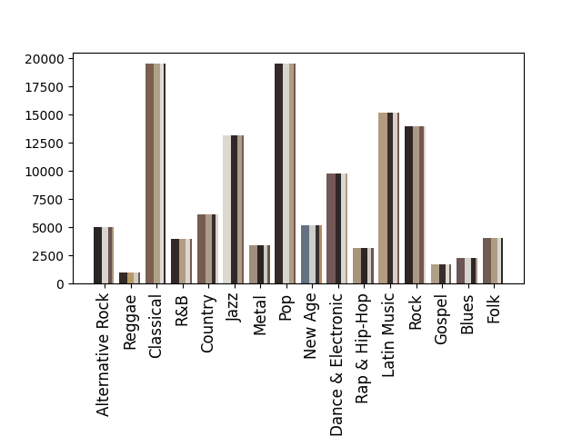

# Dark Data

This is an experiment for big-data analysis taking advantage of hadoop systems and it's MapReduce framework.

In this experiment we researched the connection between different album genres and the color of their covers to find out the most common colors of one specific genre.

**This project aims to do a big-data practice with hadoop map-reduce, which is required by a course assignment. Don't take it seriously.**

## Environments and Dependencies

**Hadoop**
- hadoop-streaming
- yarn
- hdfs

**Python**
- tqdm
- sklearn
- matplotlib
- pillow

## MapReduce

We conducted this experiment through a Map-Reduce process. Each album is designated as a mapping task to be processed by a mapper, generating a transient record. Then the reducers would collect, classify and reduce the records to the final result.



**Map**

Basically, a mapper would read records from the dataset. For each album(a given record), the mapper would request its url, fetch the cover, normalize the image, and then extract its main color taking advantage of KMeans. And mappers would generate transient records consisting of genres and main colors, and these records would then be fed to reducers.

**Reduce**

Reducers read transient records generated by mappers, c
lassify them by genres, and reduce records of the same genres to get a final result. When all reducers end, the result would be dumped out and we can visualize it to have a insight.

## Data

**Dataset**

The dataset `mard_metadata.json` comes from https://www.upf.edu/web/mtg/mard. It contains a bunch of json records and each record has 2 useful key-value pairs, `imUrl` which is the url of the cover image of an album and `root-genre` which is the genre of an album. 

**Mapper Result**

Mapper-Result stores the temporary result of the mapping stage. It contains abundant records of genres and main colors, and would be used to generate the ultimate result by reducers.

**Reducer Result**

Reducer-Result is dumped in json format listed as below.
```json
{
    "genre": _,
    "size": _,
    "hues": [
        _,
        _,
        _,
        _,
    ],
}
```


## Build and Run
We ran this pattern on a fake computer cluster composed of docker containers with the following steps.


## Result

The histogram basically lists some album genres and the 4 major colors of their covers. Y axis stands for the number of albums we analyzed, while X axis stands for the genres. Each column is represented in 4 colors which stands for the 4 main colors on the cover of a genre with thicker ones reflecting higher proportions.

Note that we are not sure whether there is actually any connections between genres and colors of the covers, so this kind of result may not be accurate at all. 

**WE MADE IT JUST FOR FUN(ALSO FOR A PRACTICE ON HADOOP MAP-REDUCE) ;)**

